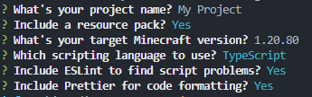

# create-regolith-addon

A better alternative to `regolith init`.

**See the [Regolith website](https://bedrock-oss.github.io/regolith/) for more information.**

## Get Started

### Prerequisites

- [Node.js](https://nodejs.org/) with npm

After installing the prerequisites, run `npx create-regolith-addon@latest` to create a new project.
